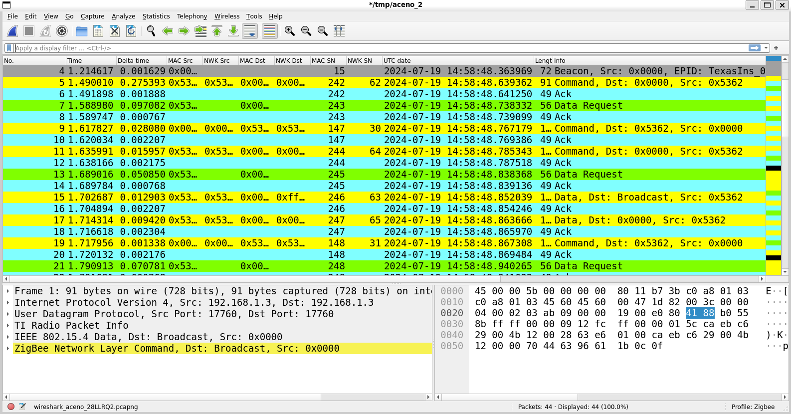

<h1 align="center">Tuxniffer</h1>
<h4 align="center">This software aims to replicate the capabilities of the <a href="https://www.ti.com/tool/PACKET-SNIFFER">SmartRF Packet Sniffer 2</a> from <a href="https://www.ti.com">Texas Instruments</a>, but through a terminal on Linux.</h4>

## Table of Contents
<!-- TOC start (generated with https://github.com/derlin/bitdowntoc) -->

- [Overview](#overview)
- [Features](#features)
- [Build Instructions](#build-instructions)
   * [Folder Creation](#folder-creation)
   * [Run CMake](#run-cmake)
   * [Build the Project](#build-the-project)
   * [Specify Debug Mode](#specify-debug-mode)
- [Usage](#usage)
   * [CLI](#cli)
      + [Options:](#options)
      + [Usage Example:](#usage-example)
   * [.YAML Config File](#yaml-config-file)
      + [Usage Example:](#usage-example-1)
- [Radio Mode Table](#radio-mode-table)
- [Using with Wireshark](#using-with-wireshark)
   * [Compiling Wireshark plugins on Linux](#compiling-wireshark-plugins-on-linux)
   * [Using Wireshark with pipes](#using-wireshark-with-pipes)
- [Use Cases](#use-cases)
- [Compatibility](#compatibility)
- [Texas Instruments Custom Packet Format](#texas-instruments-custom-packet-format)
- [Texas Instruments Documentation Issues](#texas-instruments-documentation-issues)
- [Known Issues](#known-issues)
- [Dependencies](#dependencies)

<!-- TOC end -->

<!-- TOC --><a name="overview"></a>
## Overview

The [SmartRF Packet Sniffer 2](https://www.ti.com/tool/PACKET-SNIFFER) from [Texas Instruments](https://www.ti.com) is a useful tool for sniffing packet data using some of their devices. It can save sniffed packets to a .pcap files and send packets through a pipe for live view. It also support multiple devices to be connected at once.

[Texas Instruments](https://www.ti.com) also provides, with the [SmartRF Packet Sniffer 2](https://www.ti.com/tool/PACKET-SNIFFER), Wireshark plugins to interpret the packets *(see how to configure Wireshark on Windows [here](https://dev.ti.com/tirex4-desktop/explore/node?node=A__ACyc5n.8sICFMAbB44vblg__com.ti.SIMPLELINK_CC13XX_CC26XX_SDK__BSEc4rl__LATEST&placeholder=true))*. However, despite these plugins being semi-compatible with Linux, they only make it available for Windows. **This software also has instructions for using those plugins on Linux.**  

<!-- TOC --><a name="features"></a>
## Features

This software is capable of:
- Sniffing network packets sent by Texas Instruments family CC13XX, CC26XX and Launchpad.
- Supporting multiple devices simultaneously with different Radio Modes each.
- Storing packets in a .pcap file that can be opened using Wireshark.
- Viewing packets live in Wireshark through pipes.
- Configuring Radio Mode for different packet types per device.
- Configuring the time interval between file generations.
- Splitting device data into different files/ pipes or merging it into a single file.
- Support for .YAML config file and CLI usage.

<!-- TOC --><a name="build-instructions"></a>
## Build Instructions

<!-- TOC --><a name="folder-creation"></a>
### Folder Creation

Create a directory named `build`:

```bash
mkdir build
cd build
```

<!-- TOC --><a name="run-cmake"></a>
### Run CMake

From within the build directory, run:

```bash
cmake ..
```

<!-- TOC --><a name="build-the-project"></a>
### Build the Project

Now, you can build your project using:

```bash
cmake --build .
```

<!-- TOC --><a name="specify-debug-mode"></a>
### Specify Debug Mode

By default, CMake builds in Release mode. To build in Debug mode, specify the build type when running cmake:

```bash
cmake -DCMAKE_BUILD_TYPE=Debug ..
```

Then build the project as usual:

```bash
cmake --build .
```

The binary file is now stored in `build/bin`.

<!-- TOC --><a name="usage"></a>
## Usage

<!-- TOC --><a name="cli"></a>
### CLI

Usage: `.build/bin/sniffer -p <port> -m <mode> -c <channel> [options]`

<!-- TOC --><a name="options"></a>
#### Options:
- `-h, --help`: Show help message and exit.
- `-p, --port`: Serial port to connect to *(required)*.
- `-m, --radio_mode`: Radio mode to use *(required)*.
- `-c, --channel`: Channel to use *(required)*.
- `-n, --name`: File name/ pipe name.
- `-P, --path`: Path to save file.
- `-r, --reset_period`: Reset period (none | hourly | daily | weekly | monthly).
- `-s, --log_split`: Split log files by device.
- `-t, --time_duration`: Sniffing duration in seconds.
- `-i, --input`: Input config file.

<!-- TOC --><a name="usage-example"></a>
#### Usage Example:

```bash
./tuxniffer -p /dev/ttyUSB0 -m 20 -c 25 -b sniffer -r hourly
```

Using this software through the CLI has some limitations:
- You can only define one device;
- You can only define a single base name for the .pcap file and the pipe;
- You can't disable the .pcap or pipe log;

<!-- TOC --><a name="yaml-config-file"></a>
### .YAML Config File

```yaml
# List of devices that you want to sniff. At least one device is required.
devices:
  - port: /dev/ttyACM0
    radio_mode: 20
    channel: 25
# Optional log options. Values below are the default ones.
# log:
#   enabled: true
#   path: ./
#   base_name: aceno
#   splitDevicesLog: false
#   resetPeriod: hourly # none | hourly | daily | weekly | monthly
# Optional pipe options. Values below are the default ones.
# pipe:
#   enabled: true
#   name: aceno
#   path: /tmp/
#   splitDevicesPipe: false
# Optional time in seconds to execute the sniffer. When -1 runs indefinitely (default).
# duration: -1
```

This example is also presented in the `config.yaml` file.


<!-- TOC --><a name="usage-example-1"></a>
#### Usage Example:

```bash
./tuxniffer -i config.yaml
```
**Note: when the parameter `-i` is used, other CLI parameters are ignored.**

<!-- TOC --><a name="radio-mode-table"></a>
## Radio Mode Table

This program currently supports the following Radio Modes for different kinds of packets:

| Mode Name                                                                  | Supported Channels | Radio Mode |
|----------------------------------------------------------------------------|--------------------|------------|
| IEEE 802.15.4g - GFSK 50 Kbps - 915 MHz - Freq Band                        | 0-128              | 0          |
| IEEE 802.15.4g - GFSK 50 Kbps - 868 MHz - Freq Band                        | 0-33               | 1          |
| IEEE 802.15.4g - GFSK 50 Kbps - 433 MHz - Freq Band                        | 0-6                | 2          |
| IEEE 802.15.4g - Simplelink Long Range 5 Kbps - 915 MHz - Freq Band        | 0-128              | 3          |
| IEEE 802.15.4g - Simplelink Long Range 5 Kbps - 868 MHz - Freq Band        | 0-33               | 4          |
| IEEE 802.15.4g - Simplelink Long Range 5 Kbps - 433 MHz - Freq Band        | 0-6                | 5          |
| IEEE 802.15.4g - GFSK 50 Kbps Wi-SUN PHY #1a (ID 1) - 868 MHz - Freq Band  | 0-128              | 6          |
| IEEE 802.15.4g - GFSK 50 Kbps Wi-SUN PHY #1b (ID 2) - 915 MHz - Freq Band  | 0-128              | 7          |
| IEEE 802.15.4g - GFSK 100 Kbps Wi-SUN PHY #2a (ID 3) - 868 MHz - Freq Band | 0-128              | 8          |
| IEEE 802.15.4g - GFSK 100 Kbps Wi-SUN PHY #2b (ID 4) - 915 MHz - Freq Band | 0-128              | 9          |
| IEEE 802.15.4g - GFSK 150 Kbps Wi-SUN PHY #3 (ID 5) - 868 MHz - Freq Band  | 0-128              | 10         |
| IEEE 802.15.4g - GFSK 200 Kbps Wi-SUN PHY #4a (ID 6) - 915 MHz - Freq Band | 0-128              | 11         |
| IEEE 802.15.4g - GFSK 200 Kbps Wi-SUN PHY #4b (ID 7) - 915 MHz - Freq Band | 0-128              | 12         |
| IEEE 802.15.4g - GFSK 100 Kbps ZigBee R23 - 868 MHz - Freq Band            | 0-128              | 13         |
| IEEE 802.15.4g - GFSK 500 Kbps ZigBee R23 - 868 MHz - Freq Band            | 0-128              | 14         |
| IEEE 802.15.4g - GFSK 200 Kbps - 915 MHz - Freq Band                       | 0-63               | 15         |
| Generic - GFSK 50 Kbps - 868 MHz - Freq Band                               | 0                  | 16         |
| Generic - GFSK 50 Kbps - 433 MHz - Freq Band                               | 0                  | 17         |
| Generic - Simplelink Long Range 5 Kbps - 868 MHz - Freq Band               | 0                  | 18         |
| Generic - Simplelink Long Range 5 Kbps - 433 MHz - Freq Band               | 0                  | 19         |
| IEEE 802.15.4 - O-QPSK - 2405 MHz - Freq Band                              | 11-26              | 20         |
| BLE - BLE 1 Mbps - 2402 MHz - Freq Band                                    | 37,38,39           | 21         |


<!-- TOC --><a name="using-with-wireshark"></a>
## Using with Wireshark


<!-- TOC --><a name="compiling-wireshark-plugins-on-linux"></a>
### Compiling Wireshark plugins on Linux

The ``PLUGINS.md`` file contains instructions for compiling the plugins developed by [Texas Instruments](https://www.ti.com).

<!-- TOC --><a name="using-wireshark-with-pipes"></a>
### Using Wireshark with pipes


This software allows live packet viewing using Pipes. To access the pipe use:

```bash
wireshark -k -i /<path>/<to>/<pipe_name>
```

Wireshark doesn't need to be open at the start of the sniffer execution. The sniffer will store a queue of packets during its running time, and as long as Wireshark is open while the sniffer is running, the packets will be sent in order to it.

<!-- TOC --><a name="use-cases"></a>
## Use Cases
The file `testing.md` has a list of cases for basic, intermediate and advanced uses. This file also contains a list of tests with defined inputs and expected outputs that should be checked.

<!-- TOC --><a name="compatibility"></a>
## Compatibility

- This software was compiled using gcc version 11.4.0 (Ubuntu 11.4.0-1ubuntu1~22.04).
- Boards used for testing during development:
  | Board        | Chip ID | Chip Rev | FW ID | FW Rev |
  |--------------|---------|----------|-------|--------|
  | CC1352P1     | 5313    | 21       | 50    | A1     |
  | CC1352P7-1   | 5313    | 0        | 51    | A1     |
- Firmware used: ``sniffer_fw`` version 1.10.0 (avaiable on the installation folder of the [SmartRF Packet Sniffer 2](https://www.ti.com/tool/PACKET-SNIFFER) on ``C:\Program Files (x86)\Texas Instruments\SmartRF Tools\SmartRF Packet Sniffer 2\sniffer_fw``)

<!-- TOC --><a name="texas-instruments-custom-packet-format"></a>
## Texas Instruments Custom Packet Format

Texas Instruments sends packets to Wireshark in a specific way:
- The first layer is a IPv4 packet (with fake IP addresses);
- The second layer is a UDP packet (with a fake port);
- The third layer is the "TI Radio Packet Info", that contains details about COMs, frequency, PHYs, RSSI and FCS;
- The forth layer can be other Packet Info layer (like BLE Packet Info), or the data layer (IEEE 802.15.4, BLE, ...);

**The first two layers are used only to send the "TI Radio Packet Info" by the original SmartRF Packet Sniffer 2 software and contain fake data, thus, it does not impact the data layer nor represent real IP addresses and ports.**

<!-- TOC --><a name="texas-instruments-documentation-issues"></a>
## Texas Instruments Documentation Issues

During development it was found some inconsistencies between the sniffer documentation presented by Texas Instruments and the device functioning (tested on the CC1352P1 and CC1352P7-1):

- The baudrate presented in the documentation is `921600`, but the firmware source code uses `3000000`.
- Despite showing a state machine with a `PAUSED` state in the documentation, the firmware source code doesn't have one. Therefore, neither `pause` and `resume` commands exists.
- The PHY code informed by the documentation for `IEEE 802.15.4 2.4 GHz band O-QPSK` is `0x11`, but in reality it is `0x12`.
- This happens because the [SmartRF Packet Sniffer 2](https://www.ti.com/tool/PACKET-SNIFFER) by [Texas Instruments](https://www.ti.com) has a Radio Configuration for `IEEE 802.15.4 915 MHz GSFK 200 kbps` after `0x0C`, which causes a offset of 1 to all subsequent values. This configuration is not on the reference/ documentation, but can be selected on the software. The Radio Mode table bellow is already fixed.
- The packet response documentation also informs that the response frame data payload has the format: `Timestamp (6B) | Payload (0-2047B) | RSSI (1B) | Status (1B)`. But, in reality is `Timestamp (6B) | Separator (1B) | Payload (0-2047B) | RSSI (1B) | Status (1B)`. It was not found the usage of the Separator. However, neither considering it as Timestamp or Payload work. The Timestamp gets incorrect and the Payload doesn't match the FCS at the end of the frame (last 2B of payload).
- While this software was developed using the ``CC1352P7-1`` model, the ``CC1352P1`` model was also used for tests and validation. A issue found is that on Windows, with the original [SmartRF Packet Sniffer 2](https://www.ti.com/tool/PACKET-SNIFFER), the ``CC1352P1`` could not run any 2.4GHz modes, despite having support. The solution for this issue can be found [here](https://e2e.ti.com/support/wireless-connectivity/bluetooth-group/bluetooth/f/bluetooth-forum/1229627/launchxl-cc1352p-packet-sniffer-2-error-sending-message-msg-cfgphy-problem-unknown?tisearch=e2e-sitesearch&keymatch=LAUNCHXL-CC1352P%25252525252525252520Error%25252525252525252520Sending%25252525252525252520Message#).

<!-- TOC --><a name="known-issues"></a>
## Known Issues

- Currently, when a pipe connection is closed, all pipes stop and need to be reconnected. The workaround is to open again all pipes. When a pipe is closed it stops writing to it and stores new packets in the queue, so no data is lost.

<!-- TOC --><a name="dependencies"></a>
## Dependencies
[fkYAML - Header Only Library for parsing YAML file format](https://github.com/fktn-k/fkYAML) (MIT License - Used on ``main.cpp``).
